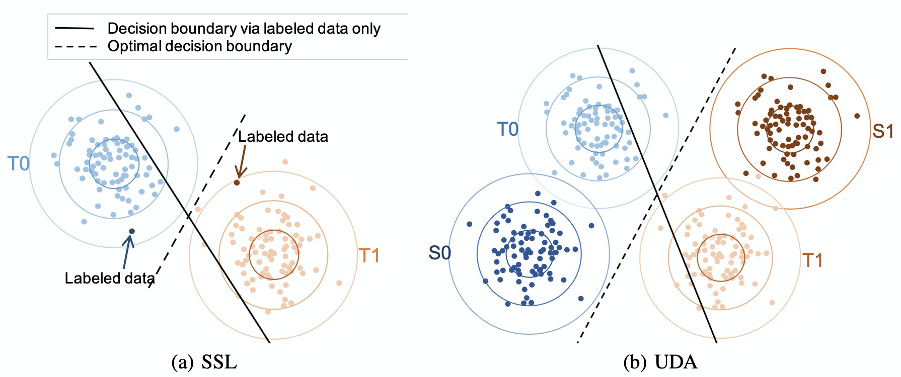
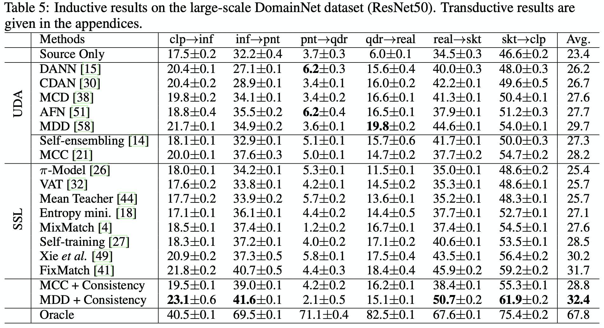

# SSL models are Strong UDA learners


## Introduction
This is the official code of paper "Semi-supervised Models are Strong Unsupervised Domain Adaptation Learners". 
It is based on pure PyTorch and presents the high effectiveness of SSL methods on UDA tasks. You can easily develop new algorithms, or readily apply existing algorithms.
Codes for UDA methods and "UDA + SSL" are given in [Here](https://github.com/zhjscut/Bridging_UDA_SSL).

The currently supported algorithms include:

##### Semi-supervised learning for unsupervised domain adatation.
- Semi-supervised learning by entropy minimization (Entropy Minimization, NIPS 2004)
- Pseudo-label: The simple and efficient semi-supervised learning method for deep neural networks (Self-training, ICMLW 2013)
- Temporal ensembling for semi-supervised learning (Pi-model, ICML 2017)
- Mean teachers are better role models: Weight-averaged consistency targets improve semi-supervised deep learning results (Mean-teacher, NIPS 2017)
- Virtual adversarial training: a regularization method for supervised and semi-supervised learning (VAT, TPAMI 2018)
- Mixmatch: A holistic approach to semi-supervised learning (MixMatch, NIPS 2019)
- Unsupervised data augmentation for consistency training (UDA, NIPS 2020)
- Fixmatch: Simplifying semi-supervised learning with consistency and confidence (FixMatch, NIPS 2020)




## Installation

This implementation is based on the [Transfer Learning Library](https://github.com/thuml/Transfer-Learning-Library).  Please refer to 'requirements' for installation.
Note that only "DistributedDataParallel" training is supported in the current branch.

## Usage

We have examples in the directory `examples`. A typical usage is 
```shell script
# Train a FixMatch on Office-31 Amazon -> Webcam task using ResNet 50.
# Assume you have put the datasets under the path `args.datapath/office-31`, 
# or you are glad to download the datasets automatically from the Internet to this path. Please go to the dictionary ./examples, and run:
CUDA_VISIBLE_DEVICES=0,1,2,3 python ../main.py --use_ema --dist_url tcp://127.0.0.1:10013 --multiprocessing_distributed --regular_only_feature --p_cutoff 0.95 --seed 1  --epochs 30  --batchsize 32 --mu 7 --iters_per_epoch 250  --source A --target W  --method Fixmatch --save_dir ../log/Office31 --dataset Office31
```

In the directory `examples`, you can find all the necessary running scripts to reproduce the benchmarks with specified hyper-parameters.
We don't provide the checkpoints since the training of each model is quick and there are too many tasks.


## Contributing
Any pull requests or issues are welcome.  Models of other SSL methods on UDA tasks are highly expected.


## Citation

If you use this toolbox or benchmark in your research, please cite this project. 

```latex
@article{zhang2021semi,
  title={Semi-supervised Models are Strong Unsupervised Domain Adaptation Learners},
  author={Zhang, Yabin and Zhang, Haojian and Deng, Bin and Li, Shuai and Jia, Kui and Zhang, Lei},
  journal={arXiv preprint arXiv:2106.00417},
  year={2021}
}
```

## Acknowledgment

We would like to thank [Transfer Learning Library](https://github.com/thuml/Transfer-Learning-Library) for their excellent contribution.

## License

MIT License, the same to [Transfer Learning Library](https://github.com/thuml/Transfer-Learning-Library).

